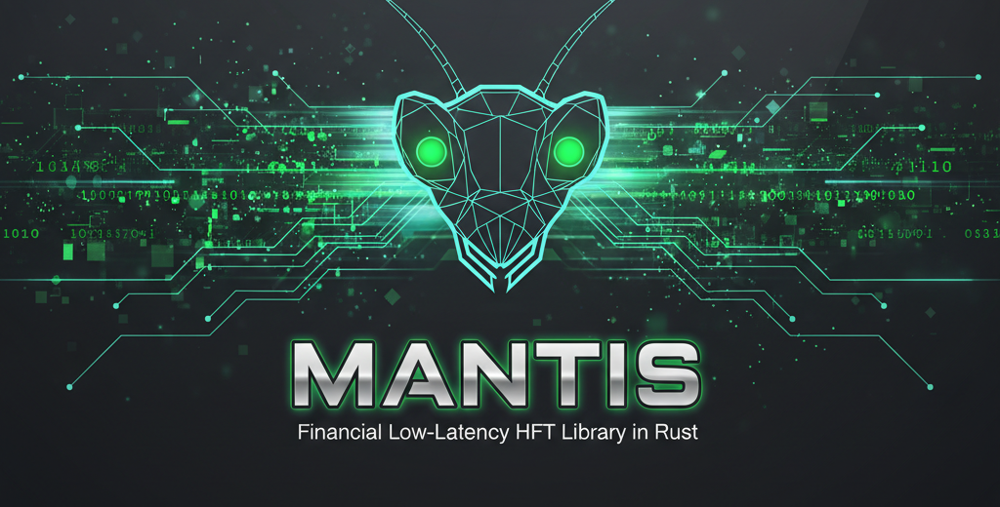
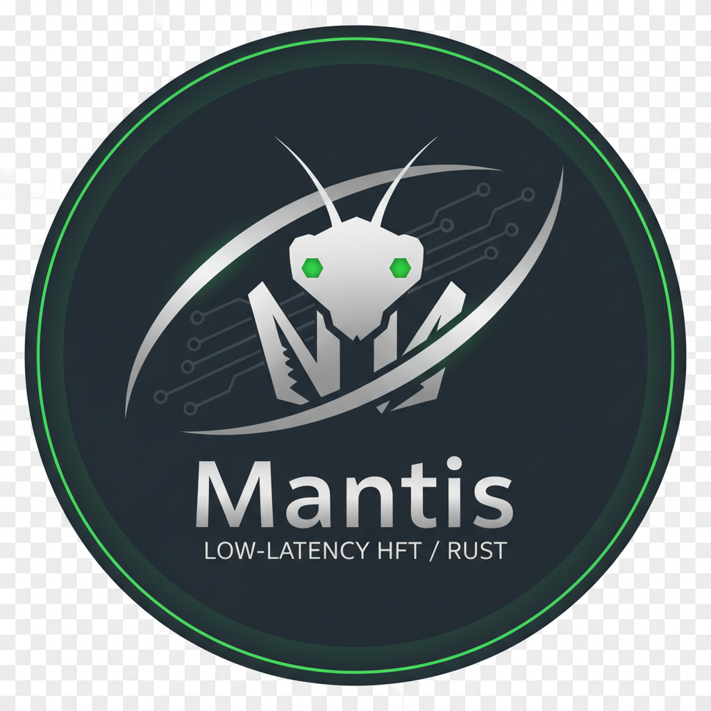

<p align="center">
  
</p>

<h1 align="center">
  
  Mantis
</h1>

<p align="center">
  A modular, <code>no_std</code>-first Rust foundation for low-latency financial systems<br>
  across centralized and decentralized markets.
</p>

<p align="center">
  <a href="https://github.com/Milerius/Mantis/actions/workflows/ci.yml"></a>
  <a href="https://codecov.io/gh/Milerius/Mantis"></a>
  <a href="https://github.com/Milerius/Mantis/actions/workflows/nightly.yml"></a>
  
  
  <a href="LICENSE"></a>
</p>

<p align="center">
  <a href="https://codecov.io/gh/Milerius/Mantis"></a>
  <a href="https://github.com/Milerius/Mantis/actions/workflows/nightly.yml"></a>
</p>

<p align="center">
  <b>42ns per event · Zero allocation on hot path · Deterministic replay · Miri + Kani verified</b>
</p>

---

## Why Mantis?

| | Mantis | Typical HFT Software | Top-Tier (FPGA) |
|---|---|---|---|
| **Event processing** | **42ns** p50 | 1-10µs | <100ns |
| **SPSC ring push/pop** | **<10ns** | 10-50ns (Disruptor) | N/A |
| **Memory allocation** | **Zero** on hot path | Minimal | Fixed in fabric |
| **Verification** | Miri + Kani + Fuzz + Bolero | Unit tests | Hardware proofs |
| **Replay** | **Deterministic** | Best-effort | Hard |
| **`no_std`** | All core crates | Rarely | N/A |

Same ballpark as Optiver/LMAX-class software systems — before network.

---

## Architecture

```
                    ┌─────────────────────────────┐
                    │      Trading Application     │
                    └──────────────┬───────────────┘
                                   │
              ┌────────────────────┼────────────────────┐
              │                    │                     │
     ┌────────▼────────┐ ┌────────▼────────┐  ┌────────▼────────┐
     │ mantis-strategy  │ │  mantis-queue   │  │ mantis-market-  │
     │                  │ │                 │  │ state           │
     │  Strategy trait  │ │  SPSC ring buf  │  │  ArrayBook      │
     │  Position, PnL   │ │  lock-free I/O  │  │  Engine, BBO    │
     │  QueueEstimator  │ │  <10ns push/pop │  │  42ns/event     │
     │  OrderTracker    │ └────────┬────────┘  └────────┬────────┘
     └────────┬─────────┘          │                    │
              │           ┌────────▼────────┐  ┌────────▼────────┐
              │           │  mantis-events  │  │  mantis-types   │
              ├──────────►│  HotEvent 64B   │  │  Ticks · Lots   │
              │           │  1 cache line   │  │  SignedLots      │
              │           └────────┬────────┘  │  InstrumentId    │
              │                    │           └────────┬────────┘
              │           ┌────────▼────────┐  ┌────────▼────────┐
              │           │  mantis-fixed   │  │ mantis-platform │
              └──────────►│  FixedI64<D>    │  │  CachePadded    │
                          │  1.10ns mul     │  │  CT types, SIMD │
                          └─────────────────┘  │  cycle counters │
                                               └─────────────────┘
```

<details>
<summary><b>Data Flow — Hot Path</b></summary>

```
Feed Handler → [SPSC Ring] → Market State Engine → Strategy.on_event() → [SPSC Ring] → Execution
                                    ↓
                             Books · BBO · Micro Price
                             Queue Position · Take Rate
                             Fill Probability · Exposure
```

Each strategy is a self-contained state machine. Same code path live and replay.
Feed the same event tape → get identical order intents.

</details>

---

## Highlights

⚡ **42ns event processing** — single-core, no locks, no allocation on hot path

🔒 **Zero-alloc hot path** — fixed-size arrays, `repr(C)` types, `no_std` everywhere

🧪 **Formally verified** — Miri (zero UB), Kani (bounded model checking), Bolero (property tests), fuzz targets

🔄 **Deterministic replay** — event-driven strategy trait: same tape = same intents

📊 **Live POC** — Nim prototype with FTXUI terminal dashboard capturing Polymarket + Binance in real-time

🏗️ **14 modular crates** — compose what you need, leave the rest

📈 **L2 queue position model** — probabilistic fill estimation using PowerProbQueueFunc

🎯 **3 rounds of AI code review** — every type pressure-tested by adversarial review

---

## Crates

| Crate | Purpose | `no_std` | Tests |
|---|---|---|---:|
| [`mantis-strategy`](crates/strategy/) | Strategy trait, Position, OrderTracker, QueueEstimator, RiskLimits | yes | 38 |
| [`mantis-market-state`](crates/market-state/) | Market-state engine: `ArrayBook`, `MarketStateEngine`, TopOfBook | yes | 17 |
| [`mantis-events`](crates/events/) | Hot event language: 64B `HotEvent` envelope for SPSC transport | yes | 62 |
| [`mantis-queue`](crates/queue/) | Lock-free SPSC ring buffer with modular strategies | yes | 31 |
| [`mantis-types`](crates/types/) | Domain types: `Ticks`, `Lots`, `SignedLots`, `Side`, `InstrumentId` | yes | 98 |
| [`mantis-fixed`](crates/fixed/) | `FixedI64<D>` compile-time fixed-point decimal engine | yes | 110 |
| [`mantis-platform`](crates/platform/) | Platform abstractions: cache padding, CT types, cycle counters, SIMD | yes | 164 |
| [`mantis-seqlock`](crates/seqlock/) | Lock-free sequence lock primitive | yes | 1 |
| [`mantis-core`](crates/core/) | Strategy traits (`IndexStrategy`, `PushPolicy`, `Instrumentation`) | yes | 1 |
| [`mantis-registry`](crates/registry/) | Instrument registry with venue bindings | yes | — |
| [`mantis-transport`](crates/transport/) | WebSocket feed handlers (Polymarket, Binance) | no | — |
| [`mantis-bench`](crates/bench/) | Criterion benchmarks + platform cycle counters + JSON reports | no | 11 |
| [`mantis-layout`](crates/layout/) | Struct layout and cache-line inspector | no | 6 |
| [`mantis-verify`](crates/verify/) | Kani proofs, Bolero property tests, differential testing | no | 13 |

---

## Benchmarks

<table>
<tr><th>SPSC Ring (Apple M4 Pro)</th><th>Fixed-Point Math</th></tr>
<tr><td>

| Workload | Mantis | rtrb | crossbeam |
|---|---:|---:|---:|
| single push+pop | **2.14 ns** | 2.48 ns | 3.93 ns |
| burst 100 | **422 ns** | 332 ns | 546 ns |

</td><td>

| Operation | Mantis | `fixed` crate | `rust_decimal` |
|---|---:|---:|---:|
| mul | **1.10 ns** | 1.20 ns | — |
| add | **0.28 ns** | — | 1.12 ns (4x slower) |

</td></tr>
</table>

Run benchmarks:
```bash
cargo bench --features bench-contenders
```

---

## Quick Start

```bash
# Build everything
cargo +nightly build --all-features

# Run all 656 tests
cargo +nightly test --all-features

# Check coverage
cargo +nightly llvm-cov --all-features

# Inspect struct layouts
cargo run -p mantis-layout

# Run benchmarks
cargo +nightly bench --bench spsc
cargo +nightly bench --bench fixed
```

---

<details>
<summary><h2>🧪 Verification Strategy</h2></summary>

| Tool | What It Catches | Scope |
|---|---|---|
| **Miri** | Undefined behavior, data races, use-after-free | All `no_std` crates on every PR |
| **Kani** | Arithmetic overflow, out-of-bounds, invariant violations | 4 bounded model checking proofs |
| **Bolero** | Edge cases via property-based + fuzz testing | 10+ property tests |
| **Fuzz** | Crash bugs in parsing + serialization | 2 fuzz targets (fixed-point) |
| **Differential** | Portable vs platform-specific divergence | 3 cross-variant comparisons |
| **Careful** | Additional UB detection beyond Miri | Full workspace |

Every PR runs: fmt → clippy → test → no_std test → Miri → coverage → deny → doc build.

Nightly runs add: mutant testing, extended Miri, full coverage, ASM inspection, Kani proofs, fuzz.

</details>

<details>
<summary><h2>🎯 Strategy Design</h2></summary>

```rust
use mantis_strategy::{Strategy, OrderIntent, MAX_INTENTS_PER_TICK};
use mantis_events::HotEvent;

struct MyStrategy { /* own state, own engine, own position */ }

impl Strategy for MyStrategy {
    const STRATEGY_ID: u8 = 0;
    const NAME: &'static str = "my-strategy";

    fn on_event(
        &mut self,
        event: &HotEvent,
        intents: &mut [OrderIntent; MAX_INTENTS_PER_TICK],
    ) -> usize {
        // Process event, update internal state, emit order intents
        0
    }
}
```

**Key properties:**
- No generics on the trait — implementation details stay inside the strategy
- Associated consts (`STRATEGY_ID`, `NAME`) — zero runtime overhead
- Enum dispatch in bot binary — no vtable, no heap, fully inlined
- Each strategy owns its own `MarketStateEngine` — no shared mutable state
- Replay: feed the same event tape → get identical intents

</details>

<details>
<summary><h2>📊 Live POC — Polymarket + Binance</h2></summary>

A working Nim prototype (`polymarket-bot-poc/`) captures Polymarket prediction markets + Binance reference feeds with an FTXUI terminal dashboard.

**Features:**
- Multi-market: BTC, SOL, ETH up-or-down 5m markets
- 6-thread architecture: ingest(2) + engine + telemetry + dashboard + main
- FTXUI 3-column trading terminal with Canvas charts
- Depth ladders (UP/DOWN PM books + Binance depth20 L2)
- Probability history, latency histogram, event rate sparkline
- Queue gauges, feed status, trade tape, market tab switching
- Binary mmap tape output with zstd compression
- Engine latency: p50=42ns, p99=1-5µs
- CPU: ~9% with yield-on-idle

See [`polymarket-bot-poc/README.md`](polymarket-bot-poc/README.md) for build instructions.

</details>

<details>
<summary><h2>🏛️ Design Principles</h2></summary>

1. **Correctness first** — Kani proofs, Miri, differential tests
2. **Safety** — all unsafe isolated in `raw` modules with `// SAFETY:` comments
3. **Performance** — benchmarked, layout-inspected, ASM-verified
4. **`no_std` first** — no heap in hot paths, `alloc` optional
5. **Replay-friendly** — every component is a deterministic state machine
6. **Venue-agnostic** — no prediction market concepts in core SDK

See [CLAUDE.md](CLAUDE.md) for the full development guide.

</details>

<details>
<summary><h2>📋 Project Status</h2></summary>

See [docs/PROGRESS.md](docs/PROGRESS.md) for detailed tracking.

**Phase 1 — Completed:**
- SPSC ring buffer with strategy pattern
- Benchmark harness (RDTSC, kperf, criterion)
- Platform abstractions (CT types, SIMD, cache padding)
- Fixed-point decimal engine
- 64B HotEvent model (8 variants)
- Sequence lock
- Market state engine (ArrayBook, BBO tracking)
- Strategy runtime (trait, position, queue estimator, risk)

**In Progress (by collaborators):**
- Instrument registry with venue bindings
- WebSocket transport (Polymarket, Binance)

**Next:**
- Execution engine (order management, signing, fill routing)
- Risk management (per-strategy + global wallet)
- Capture/replay framework
- `mantis-prediction` crate (binary outcome positions)

</details>

---

## License

Apache-2.0
