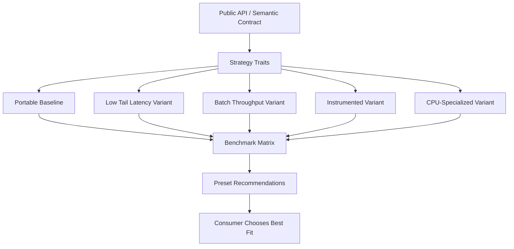
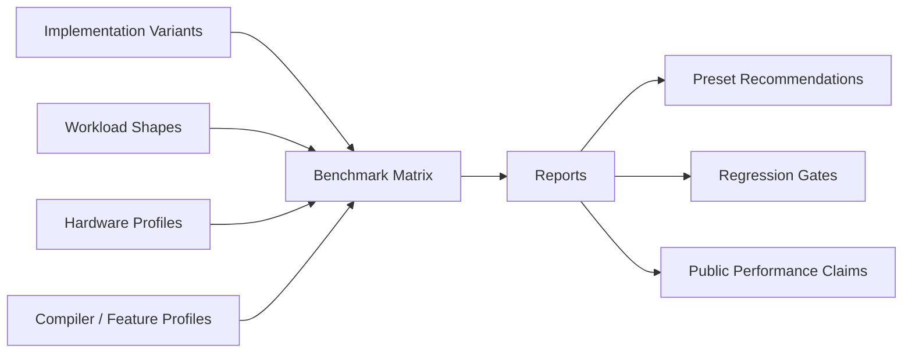
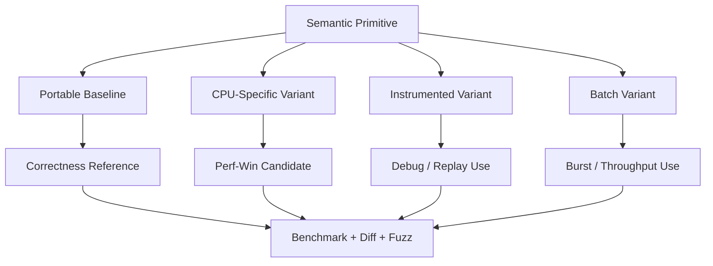

# Benchmarking, Tooling, and Modular Container Strategy — Design Doc

## 1. Purpose

This document defines the philosophy and architecture for:

- benchmarking
- profiling
- hot-path tooling
- modular container design
- strategy-driven implementations
- compile-time specialization
- consumer-selectable performance profiles

The core premise is simple:

> In low-latency systems, there is no single universally optimal container or queue implementation.

Different workloads want different trade-offs:
- smallest tail latency
- highest throughput
- minimal memory footprint
- lowest instruction count
- no_std compatibility
- deterministic replay compatibility
- batch-friendly behavior
- CPU-specific specialization
- predictable behavior under burst/backpressure

So the framework should not ship one generic implementation and hope for the best.

It should ship a **family of implementations with a common abstraction model**, strong benchmark tooling, and a clear way for users to choose the best fit for their environment.

---

## 2. Core philosophy

### 2.1 No “one best” implementation
For containers such as:
- SPSC rings
- MPSC queues
- fixed-capacity vectors
- slab-like storage
- intrusive lists
- book-side storage
- snapshot stores

the best implementation depends on:
- contention model
- payload size
- burstiness
- producer/consumer ratio
- CPU architecture
- cache layout
- tail-latency sensitivity
- allocation constraints
- instrumentation needs

So the framework should optimize for:
- **measurable specialization**
- **stable abstraction**
- **easy comparison**
- **explicit trade-offs**

### 2.2 Performance claims must be benchmark-backed
The framework should never claim:
- “fastest”
- “zero overhead”
- “best in class”

unless this is supported by a published benchmark protocol, reproducible environments, and honest comparison data.

### 2.3 Tooling is part of the architecture
Benchmarking and profiling are not afterthoughts. They are required to:
- guide implementation choices
- validate optimizations
- prevent regressions
- help consumers choose the right variant

### 2.4 Compile-time specialization first, runtime dispatch second
Where possible:
- prefer compile-time selection
- use monomorphization to remove abstraction cost
- keep runtime dispatch for boundaries where user ergonomics matter more than absolute cost

### 2.5 Stable contract, flexible backend
The public API should remain relatively stable while allowing multiple implementations behind it.

---

## 3. What “modular implementation” means

A modular design should allow the consumer to choose between multiple implementation strategies for the same conceptual primitive.

Examples:

### 3.1 SPSC rings
Variants might include:
- minimal scalar generic baseline
- cache-padded low-contention version
- batch-optimized version
- borrowed-slot / zero-copy version
- instrumentation-friendly version
- CPU-specialized version

### 3.2 Fixed-capacity storage
Variants might include:
- plain array-backed
- bitset-assisted occupancy tracking
- slab-style indexed storage
- intrusive linked layout
- SoA variant for scan-heavy workloads
- AoS variant for update-heavy workloads

### 3.3 Order book internals
Variants might include:
- flat-array tick-indexed
- sorted vector levels
- tree-backed sparse levels
- dense hot band + sparse cold spillover
- hybrid cache-local best-level representation

### 3.4 Snapshot publication
Variants might include:
- double buffer
- generation-indexed publication
- copy-on-write snapshot
- lock-free publish pointer
- single-writer / multi-reader specialized publication

---

## 4. Design goals for the modular system

The modular strategy system should satisfy these goals:

- clear public API
- low overhead
- no_std-friendly in the core
- compile-time specialization where possible
- opt-in runtime configurability
- benchmarkability
- easy A/B comparison
- stable semantics across implementations
- implementation-specific tuning exposed explicitly

---

## 5. Architecture model

The best model is:

### 5.1 Concept / contract
Define the semantic contract for a primitive.

Example:
- queue semantics
- failure behavior
- ordering guarantees
- capacity semantics
- overwrite/drop policy
- allocation policy
- thread ownership assumptions

### 5.2 Strategy traits
Define low-level behavior points that can vary.

Example:
- index strategy
- memory layout strategy
- publish strategy
- contention strategy
- instrumentation strategy

### 5.3 Concrete implementations
Build multiple concrete variants.

### 5.4 Profiles / presets
Expose curated combinations to consumers.

Example:
- `portable_baseline`
- `low_tail_latency`
- `batch_throughput`
- `instrumented_debug`
- `baremetal_x86_avx2`
- `arm64_server`

### 5.5 Benchmark matrix
Continuously compare all supported variants.

---

## 6. Recommended Rust design style

Use modern Rust with:

- const generics
- zero-cost traits where practical
- sealed traits for internal extension control
- feature flags for optional implementations
- cfg-based architecture specialization
- newtype wrappers for strong semantics
- explicit memory layout annotations where hot
- no_std core and std adapters/tooling

Avoid:
- heavy macro DSLs for core logic
- too much trait indirection in hot paths
- unstable semantics hidden behind generic APIs
- “kitchen sink” generic types with too many knobs on one type

---

## 7. Semantic layers

### 7.1 Public semantic layer
This is what users reason about:
- queue
- ring
- book side
- snapshot publisher
- container
- strategy preset

This layer should be clean and stable.

### 7.2 Implementation layer
This is where variants live:
- padded indices
- mask vs modulo
- batch commit logic
- borrow-slot APIs
- sequence counters
- dense/sparse storage layouts
- feature-specific SIMD helpers

### 7.3 Tooling layer
This exposes observability:
- counters
- timing hooks
- benchmark adapters
- layout reports
- tracing integration
- replay metadata

---

## 8. Mermaid: modular container architecture



---

## 9. Example design for an SPSC ring family

## 9.1 Semantic contract
An SPSC ring should define:
- single producer only
- single consumer only
- FIFO ordering
- bounded capacity
- push behavior when full
- pop behavior when empty
- ownership model for payload
- memory ordering guarantees
- whether batch operations are supported
- whether zero-copy slot borrow is supported

### 9.2 Variation points
Possible variation points:
- head/tail index layout
- cache padding strategy
- slot metadata layout
- commit model
- batch publish/consume support
- borrowed slot API or value API
- instrumentation hooks
- architecture-specific fast paths

### 9.3 Presets
Possible presets:
- `Portable`
- `Padded`
- `Batched`
- `Borrowed`
- `Instrumented`
- `X86Optimized`
- `ArmOptimized`

---

## 10. How to expose this in Rust

There are three good ways.

### 10.1 Distinct concrete types
Example:
- `SpscRingPortable<T, N>`
- `SpscRingPadded<T, N>`
- `SpscRingBatched<T, N>`

Pros:
- simple
- explicit
- good for docs
- zero ambiguity

Cons:
- more surface area

### 10.2 One generic type with strategy parameters
Example:
- `SpscRing<T, N, Indexing, Publish, Instrumentation>`

Pros:
- very flexible
- compile-time composable

Cons:
- can become too abstract if overdone

### 10.3 Curated preset aliases over generic internals
This is usually the best public design.

Example:
- `type SpscRingPortable<T, const N: usize> = SpscRing<T, N, MaskedIndex, ImmediatePublish, NoInstr>;`
- `type SpscRingPadded<T, const N: usize> = SpscRing<T, N, MaskedIndex, ImmediatePublish, CacheAwareInstr>;`

This gives:
- strong internal reuse
- clean public types
- compile-time specialization
- readable docs

---

## 11. Recommended approach

Use:
- **generic internal engine**
- **curated public preset types**
- **feature-gated advanced variants**
- **optional runtime selection only outside the hot path**

This gives the best balance.

---

## 12. Example Rust skeleton

```rust
#![no_std]

use core::marker::PhantomData;

pub trait PushPolicy {}
pub trait Instrumentation {}
pub trait IndexStrategy {}

pub struct ImmediatePush;
impl PushPolicy for ImmediatePush {}

pub struct NoInstr;
impl Instrumentation for NoInstr {}

pub struct Pow2Masked;
impl IndexStrategy for Pow2Masked {}

pub struct SpscRing<
    T,
    const N: usize,
    I: IndexStrategy,
    P: PushPolicy,
    M: Instrumentation,
> {
    _marker: PhantomData<(T, I, P, M)>,
}

pub type SpscRingPortable<T, const N: usize> =
    SpscRing<T, N, Pow2Masked, ImmediatePush, NoInstr>;
```

The point is not the exact traits above. The point is the pattern:
- internal generic composition
- externally exposed presets
- no runtime cost in the fast path

---

## 13. Runtime selection: when to allow it

Runtime selection is useful for:
- CLI tools
- config-driven experimentation
- benchmark harnesses
- environment-based preset selection
- non-hot-path initialization

It is usually not desirable in the innermost hot path.

Good pattern:
- select the implementation at startup
- build the pipeline with that concrete type
- run monomorphic hot loops after initialization

---

## 14. Compile-time generation of multiple variants

The project should intentionally generate and benchmark multiple variants.

Examples:
- `portable`
- `padded`
- `batched`
- `instrumented`
- `x86_avx2`
- `arm_neon`

This can be done with:
- cargo features
- cfg(target_arch)
- cfg(target_feature)
- build profiles
- preset type aliases
- benchmark harness matrices

The important thing is not just to support variants, but to make them easy to compare.

---

## 15. Benchmark philosophy

Benchmarking must answer:
- which implementation is best?
- in which environment?
- under which workload?
- by which metric?

Not just:
- which one was fastest once on my machine?

### 15.1 Types of benchmarks

#### Microbench
Measures isolated operations:
- push
- pop
- update level
- apply delta
- quote path
- funding calc

#### Scenario bench
Measures shaped workloads:
- burst producer
- near-full queue
- near-empty queue
- skewed read/write rates
- mixed small/large payloads

#### Pipeline bench
Measures realistic path:
- parse -> normalize -> queue -> state -> decision

#### Regression bench
Compares current build vs baseline.

### 15.2 Metrics to record
- throughput
- p50 / p99 / p99.9
- cycles/op
- instructions/op
- branch misses
- L1 / LLC misses
- alloc count
- queue occupancy
- drop/full/empty hit rates
- footprint per slot

### 15.3 Benchmark matrix
The benchmark harness should compare:
- implementations
- payload sizes
- capacities
- CPUs
- profiles
- compiler flags
- architectures

---

## 16. Mermaid: benchmark matrix



---

## 17. Tooling philosophy

Tooling must support both framework authors and framework consumers.

### 17.1 For framework authors
Need:
- asm inspection
- perf counters
- layout analysis
- cache-line reports
- false-sharing suspicion
- replay diffing
- benchmark regressions

### 17.2 For consumers
Need:
- easy benchmark commands
- profile presets
- TUI/CLI visibility
- clear preset recommendations
- reproducible reports
- environment-aware selection guidance

---

## 18. First-version tooling stack

A robust v0.1 should include:

### 18.1 Benchmark harness
Must support:
- per-implementation runs
- matrix runs
- CSV/JSON export
- comparison reports
- baseline/candidate diff

### 18.2 Layout inspector
Should report:
- size
- alignment
- field offsets
- padding
- cache-line occupancy estimate
- false-sharing suspicion

### 18.3 Assembly inspection helper
Should make it easy to inspect hot functions:
- generated asm path
- before/after diff
- inlining visibility
- code size visibility

### 18.4 Perf counter integration
Should collect:
- cycles
- instructions
- branches
- branch-misses
- cache refs/misses

### 18.5 TUI
Should show:
- active topology
- selected preset
- queue depths
- stage latencies
- replay delta vs baseline
- current hardware profile

### 18.6 Fuzz / invariant integration
Should allow:
- implementation-specific fuzzing
- cross-implementation differential fuzzing
- replay determinism checks

---

## 19. TUI concept

A simple TUI can be extremely useful.

### 19.1 Suggested panes

#### Topology pane
```text
[ingress] -> [decode] -> [queue:padded] -> [book:flat_dense] -> [strategy]
```

#### Implementation pane
```text
queue impl: SpscRingPadded<u64, 1024>
profile: baremetal-x86-avx2
cpu features: avx2,bmi2,popcnt
```

#### Performance pane
```text
throughput: 210 M msg/s
p99 latency: 82 ns
cycles/op: 54
L1 miss/op: 0.4
branch miss: 0.3%
```

#### Comparison pane
```text
portable baseline: 198 M msg/s
selected preset:   210 M msg/s
delta: +6.1%
```

#### Health pane
```text
queue occupancy: 12%
producer stalls: 0
consumer stalls: 2
drops: 0
```

---

## 20. Differential testing across implementations

A very powerful idea:

> Different implementations of the same semantic primitive should be differentially tested against each other.

For example:
- `SpscRingPortable` vs `SpscRingPadded`
- `BookSideDense` vs `BookSideSparse`
- `SnapshotDoubleBuffer` vs `SnapshotGenPub`

Same generated workload, same expected semantics.

This helps catch:
- ordering bugs
- edge-condition divergence
- subtle overflow/indexing issues
- behavior drift when optimizing

---

## 21. Consumer-facing selection model

Consumers should have multiple ways to choose.

### 21.1 Explicit type choice
For expert users.

Example:
- choose exact queue type

### 21.2 Preset choice
For most users.

Examples:
- `portable`
- `low_tail_latency`
- `batch_throughput`
- `instrumented_debug`
- `x86_baremetal`

### 21.3 Recommendation engine
The tooling can suggest:
- “for payload 8B on x86_64 AVX2, use `SpscRingPadded`”
- “for replay-heavy instrumentation, use `Instrumented`”
- “for small ARM systems, use `Portable`”

This can come directly from benchmark reports.

---

## 22. Hardware-specific philosophy

CPU-specific optimization should be structured, not chaotic.

### 22.1 Layered approach

#### Portable baseline
Always available.
Used for:
- correctness
- portability
- fallback
- reference comparison

#### CPU-specific specializations
Examples:
- x86_64 AVX2
- x86_64 BMI2
- arm64 NEON

Used only where measured benefit exists.

#### Environment presets
Examples:
- laptop_dev
- ci_deterministic
- baremetal_x86
- arm64_server

### 22.2 Rules
- never remove the portable baseline
- specialized path must be benchmark-proven
- specialized path must be correctness-equivalent
- tooling must show which path is active
- public docs must state the exact conditions where it wins

---

## 23. Mermaid: specialization model



---

## 24. Benchmark report philosophy

A good report should say:

- implementation tested
- exact compiler flags
- exact CPU / architecture
- exact payload / capacity
- exact threading model
- exact policy (full/empty behavior)
- metrics
- comparison against baseline
- recommendation

This makes the result useful and credible.

---

## 25. Example benchmark report schema

```text
Primitive: SPSC Ring
Payload: 8B
Capacity: 1024
Workload: steady_state_balanced
CPU: Intel i9-9900K
Profile: baremetal-x86-avx2
Compiler: rustc stable, -C opt-level=3 -C target-cpu=native

Results:
- Portable:       198 M/s, p99 91 ns, 58 cyc/op
- Padded:         210 M/s, p99 82 ns, 54 cyc/op
- Batched:        218 M/s, p99 95 ns, 52 cyc/op
- Instrumented:   180 M/s, p99 110 ns, 67 cyc/op

Recommendation:
- choose Padded for lowest tail latency
- choose Batched for max throughput
- choose Instrumented only for debug/replay workflows
```

---

## 26. What the first version should ship

For v0.1, keep the philosophy strong but scope narrow.

### 26.1 Minimum modular primitives
Ship modularity for:
- SPSC ring
- one fixed-capacity container
- one order-book side storage type
- one snapshot publication primitive

### 26.2 Minimum presets
Ship:
- portable
- padded
- instrumented

### 26.3 Minimum tooling
Ship:
- benchmark matrix runner
- layout inspector
- perf counter integration
- assembly helper
- simple TUI
- differential testing harness

### 26.4 Minimum reports
Ship:
- machine-readable output
- markdown summary output
- baseline vs candidate diff
- recommendation block

---

## 27. Strong recommendation for API design

The cleanest public model is:

- public semantic contract traits
- internal strategy traits
- curated preset aliases
- optional runtime selection outside hot loops
- benchmark and tooling first-class in the workspace

This gives:
- performance
- modularity
- clarity
- maintainability
- room for future specialization

---

## 28. Final position

The project should explicitly embrace this idea:

> We do not provide one generic implementation that pretends to fit every workload.  
> We provide a set of rigorously benchmarked, semantically consistent implementations and presets, so the consumer can choose the right one for their environment and priorities.

That is a stronger and more honest philosophy than chasing a single “best” abstraction.

And it fits perfectly with a serious low-latency Rust framework.
