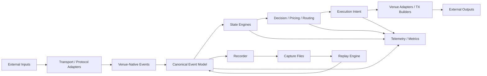
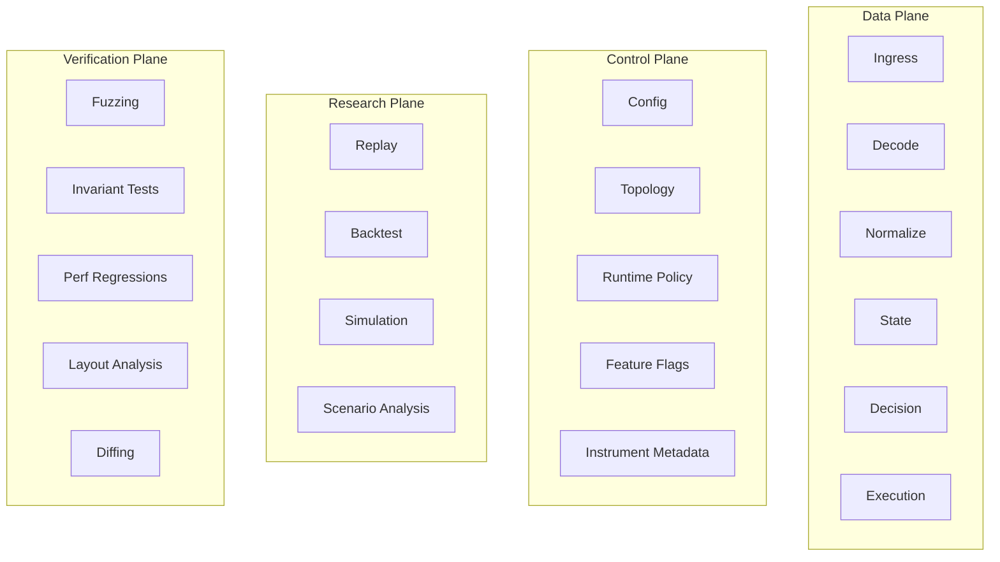
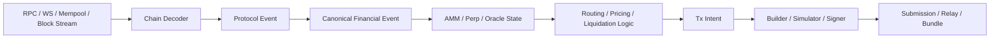
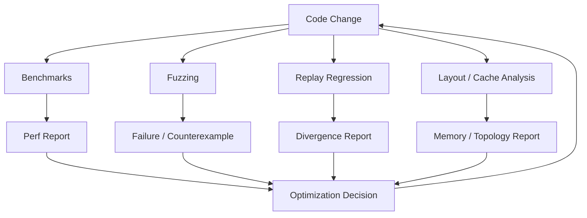

# Low-Latency Rust Financial SDK — OSS Blueprint

## 1. Vision

Build a **no_std-first, low-latency Rust SDK for financial systems** spanning:

- centralized finance
- decentralized finance
- order books
- perpetuals
- AMMs
- swaps
- prediction markets
- routing
- simulation
- replay
- verification
- performance tooling

The SDK is not just a collection of API clients. It is a **systems platform** for building financial engines under strict latency, determinism, and correctness constraints.

Core positioning:

> A modular, no_std-first Rust foundation for low-latency financial systems across centralized and decentralized markets, with first-class replay, verification, and performance tooling.

---

## 2. What this SDK should enable

Once mature, the SDK should make it possible to build:

### Centralized finance
- normalized market data plants
- order management systems
- execution management systems
- smart order routers
- market-making engines
- futures/perpetuals execution engines
- internal exchange engines
- prediction market matching engines

### Decentralized finance
- AMM pricing and route engines
- cross-DEX routers
- perp state/risk engines
- liquidation bots
- keepers
- CEX-DEX arbitrage engines
- prediction market engines
- hybrid CLOB + AMM systems
- protocol analytics/surveillance platforms

### Tooling / infra
- deterministic replay platforms
- scenario simulators
- fuzz and invariant labs
- performance regression frameworks
- hot-path topology visualizers
- layout/cache-line analysis tooling
- queue/latency instrumentation suites

---

## 3. Key design principles

### 3.1 no_std-first
The hot-path and mathematical core should be `no_std` first.

Good candidates:
- core types and IDs
- canonical event model
- book engines
- AMM math/state
- perp state/risk math
- ring buffers and bounded queues
- snapshot publication primitives
- deterministic codecs
- fixed-capacity containers

`std` should only appear at the system edges:
- files
- sockets
- async runtimes
- CLI
- profiling integrations
- dashboard / visualization tooling
- exchange / chain network adapters

### 3.2 Sync fast path, async edges
- async is acceptable for edge I/O
- the internal hot path should favor explicit loops, bounded queues, pinned threads, and deterministic handoff behavior

### 3.3 Small canonical event model
The SDK must define a stable canonical event layer that sits between venue-native protocols and internal engines.

### 3.4 Deterministic replay as a first-class mode
Replay is not a side feature. It is part of the architecture.

### 3.5 Tooling is part of the product
Benchmarking, profiling, fuzzing, layout inspection, topology visualization, and replay diffing must be first-class citizens.

### 3.6 Modular crates, not one giant framework
Users should be able to adopt only the pieces they need.

---

## 4. Big-picture architecture

The SDK should be split into four planes:

1. **Data plane**
2. **Control plane**
3. **Research plane**
4. **Verification plane**

### 4.1 Data plane
Hot path:
- ingress
- decoding
- normalization
- state updates
- pricing/routing/strategy
- execution intent generation
- egress

### 4.2 Control plane
Slow path:
- configuration
- venue wiring
- strategy registration
- feature flags
- symbol/instrument metadata
- topology setup
- runtime selection
- CPU/thread placement policy
- observability mode

### 4.3 Research plane
Offline / semi-offline:
- replay
- simulation
- backtesting
- scenario analysis
- route search experiments
- parameter sweeps
- pnl attribution

### 4.4 Verification plane
Correctness + performance assurance:
- fuzzing
- invariant testing
- differential tests
- deterministic replay checks
- perf regression checks
- struct layout analysis
- cache / branch / alloc inspection
- handoff latency analysis
- false sharing diagnostics

---

## 5. System diagrams

### 5.1 Overall architecture



### 5.2 Four-plane architecture



### 5.3 Data movement model

```mermaid
flowchart LR
    A[Borrowed Raw View<br/>&[u8] / frame slices] --> B[Venue-Native Typed Event]
    B --> C[Canonical Owned Event]
    C --> D[State Engine]
    D --> E[Snapshot Publication]
    E --> F[Readers / Strategies / Risk / Visualizer]
```

### 5.4 CEX-style pipeline


### 5.5 DeFi-style pipeline



### 5.6 Tooling feedback loop



---

## 6. Canonical event model

The SDK should define a layered event taxonomy.

### 6.1 Layer 0 — raw transport
- raw packet/frame
- websocket frame
- RPC response payload
- block/log/transaction payload
- FIX/ITCH/OUCH bytes

### 6.2 Layer 1 — venue-native typed event
Examples:
- Binance depth diff
- Coinbase trade update
- Hyperliquid fill event
- Drift funding update
- Solana account change
- Uniswap swap event

### 6.3 Layer 2 — canonical financial event
Examples:
- trade
- top of book quote
- book delta
- order accepted
- order rejected
- fill
- position update
- balance update
- pool reserve update
- swap event
- oracle update
- funding update
- liquidation event
- mark/index price update

### 6.4 Layer 3 — derived engine event
Examples:
- fair price updated
- risk breach
- opportunity detected
- rebalance requested
- route selected
- hedge requested
- liquidation candidate detected

---

## 7. Domain model coverage

The SDK should support multiple market microstructure families without forcing fake sameness.

### 7.1 Order-book venues
- L1/L2/L3 deltas
- trades
- order lifecycle
- fills
- cancels
- rejects

### 7.2 AMMs
- reserve changes
- swap events
- fee growth
- virtual price
- tick/liquidity net changes
- route quotes

### 7.3 Perpetuals
- mark/index/oracle price
- funding rate
- funding payment
- open interest
- margin state
- position state
- liquidation state
- collateral updates

### 7.4 Prediction markets
- market definition
- implied probabilities
- yes/no order book
- AMM curve state
- settlement state
- payout event
- liquidity state

### 7.5 RFQ / auction / intent systems
- quote request
- quote response
- auction result
- settlement status
- intent lifecycle

---

## 8. Communication and topology patterns

Only a few communication patterns should be first-class.

### 8.1 SPSC ring
Best for:
- parser -> normalizer
- normalizer -> state
- state -> strategy
- strategy -> execution

### 8.2 MPSC bounded queue
Best for:
- multiple producers into one coordinator
- multiple strategies into one execution router

### 8.3 Snapshot publication
Best for:
- book snapshots
- AMM snapshots
- oracle state
- route graph state
- risk state

### 8.4 Fanout observer bus
Best for:
- metrics
- recorder
- visualizer
- debug observers

### 8.5 Handoff policy
Every stage boundary should declare:
- ownership policy
- copy policy
- batching policy
- backpressure policy
- queue type
- threading assumptions
- determinism expectations

---

## 9. State design system

Separate state by heat.

### 9.1 Hot state
Touched on every event:
- top of book
- last trade
- current position
- risk counters
- latest oracle value
- pool reserves

Requirements:
- compact
- single-writer where possible
- minimal padding
- no heap after init ideally

### 9.2 Warm state
Accessed often, but not per event:
- symbol metadata
- fee tiers
- account config
- route graph
- market config

Requirements:
- snapshot-friendly
- mostly read-only
- safe sharing across readers

### 9.3 Cold state
- logs
- audit trails
- documentation-like metadata
- historical archives
- verbose diagnostics

Must be kept off the hot path.

---

## 10. Design system of the SDK

This is the internal engineering contract that should apply to every hot-path module.

Each module should clearly define:

- input type
- output type
- ownership model
- allocation policy
- thread model
- determinism guarantee
- invariants
- benchmark coverage
- fuzz coverage
- instrumentation modes

### 10.1 Example contract

**OrderBookEngine**
- input: `BookDelta`
- output: `TopOfBookChanged`, `TradeApplied`, `SnapshotReady`
- ownership: owned canonical event in, internal mutable state
- thread model: single-writer
- allocation policy: no allocation after init
- determinism: deterministic given ordered inputs
- invariants:
  - bid levels sorted descending
  - ask levels sorted ascending
  - top-of-book consistent
- verification:
  - fuzz target
  - invariant tests
  - snapshot diff tests
- benchmark:
  - microbench update cost
  - burst scenario
  - p50/p99 latency
- instrumentation:
  - queue depth
  - update latency
  - crossed-book detection

### 10.2 Design rules
- explicit ownership
- bounded memory where possible
- versioned canonical types
- opt-in instrumentation
- unstable/experimental modules clearly marked
- unsafe isolated and documented
- every optimization measurable
- every hot-path data structure layout inspected

---

## 11. Crate map

Suggested structure:

```text
fin_core/           no_std core traits and shared foundations
fin_types/          no_std IDs, numeric wrappers, enums, core data types
fin_time/           no_std time/timestamp abstractions
fin_event/          no_std canonical event model
fin_codec/          no_std deterministic codecs / binary formats
fin_queue/          no_std bounded queues / rings / handoff primitives
fin_snapshot/       no_std publication primitives
fin_book/           no_std order book engines
fin_amm/            no_std AMM math and state engines
fin_perps/          no_std perpetuals state/risk engines
fin_risk/           no_std risk math and exposure primitives
fin_predict/        no_std prediction market primitives
fin_router/         std route / execution planning layer
fin_exec/           std order/tx intent layer
fin_capture/        std capture recording
fin_replay/         std replay engine
fin_sim/            std scenario simulator / backtest harness
fin_profile/        std perf/profile wrappers
fin_layout/         std struct layout / cache-line analysis tooling
fin_visualizer/     std topology / latency / queue visualization
fin_bench/          std benchmark suite / harness
fin_fuzz/           std or workspace fuzz harnesses
fin_cli/            std top-level CLI
fin_examples/       example apps and reference systems
fin_adapter_fix/    std FIX adapter
fin_adapter_cex_*/  std centralized exchange adapters
fin_adapter_evm/    std EVM protocol/chain adapters
fin_adapter_solana/ std Solana protocol/chain adapters
```

---

## 12. Tooling as a first-class pillar

Tooling is one of the main differentiators.

### 12.1 Benchmarking
Need:
- microbenchmarks
- scenario benchmarks
- pipeline benchmarks
- replay benchmarks
- latency histograms
- allocation counts
- copy counts
- throughput and burst behavior

### 12.2 Profiling
Need wrappers/integration for:
- CPU profiles
- flamegraphs
- cache misses
- branch mispredicts
- instruction counts
- memory bandwidth behavior

### 12.3 Layout / memory analysis
Need:
- struct size reports
- alignment/padding analysis
- cache-line occupancy estimation
- false-sharing suspicion reports
- hot-state footprint summaries

### 12.4 Handoff / topology observability
Need:
- queue depth tracking
- handoff latency tracking
- stage occupancy
- burst/drop metrics
- load imbalance indicators

### 12.5 Replay diffing
Need:
- event sequence diffs
- strategy decision diffs
- order intent diffs
- output divergence reports
- performance comparison across builds

### 12.6 Fuzzing / invariant testing
Need:
- parser fuzzing
- order book invariant fuzzing
- AMM math fuzzing
- funding/risk/liquidation fuzzing
- serialization round-trip fuzzing
- replay determinism fuzzing
- adapter differential tests

### 12.7 Visualizer
The visualizer should show:
- pipeline graph
- stage timings
- queue depths
- drops/stalls
- cross-core handoff suspicion
- cache/false-sharing suspicion
- replay divergence overlays

### 12.8 Suggested CLI shape
Examples:

```bash
fin bench book_l2
fin bench replay binance_open
fin profile replay hyperliquid_day
fin layout report fin_book::BookLevel
fin topo inspect config/dev_topology.toml
fin diff replay baseline.capture candidate.capture
fin fuzz run orderbook
```

---

## 13. Examples of products this SDK can power

### 13.1 Centralized finance
- normalized market data gateway
- market making engine
- futures/perps execution engine
- smart order router
- internal OMS/EMS
- prediction market CLOB
- internal exchange matching/risk engine

### 13.2 Decentralized finance
- DEX swap router
- AMM quote engine
- perp keeper/liquidator framework
- CEX-DEX arb engine
- hybrid CLOB + AMM venue
- prediction market platform
- protocol surveillance platform

### 13.3 Hyperliquid / Drift family
This SDK should be strong enough to build:

- **Hyperliquid-like engine layers**
  - order book / matching
  - perp state
  - funding
  - risk and liquidation
  - market data and automation
  - profiling / replay / verification

- **Drift-like engine layers**
  - perp + margin state
  - AMM / hybrid liquidity logic
  - liquidation/keeper framework
  - risk engine
  - pricing / oracle / routing infra

Important distinction:
- the SDK can power the **core engines and surrounding infra**
- the SDK alone does not replace chain/runtime/protocol-specific implementation work

---

## 14. OSS strategy

### 14.1 What to open source first
Open source:
- core types
- canonical event model
- queues / handoff primitives
- one book engine
- one AMM engine
- one perp state engine
- deterministic capture/replay format
- benchmark harness
- fuzz harness examples
- layout inspection tooling
- topology visualization MVP
- a few adapters
- serious examples

### 14.2 What not to do initially
Avoid:
- giant framework complexity
- too many venues/protocols in v0.1
- premature plugin systems
- over-designed async abstractions
- macro-heavy public API
- unstable APIs across every release
- trying to monetize too early

### 14.3 Adoption strategy
To win adoption:
- keep the core stable
- ship real benchmarks
- show replay correctness
- provide excellent examples
- document invariants and unsafe blocks
- make tooling unusually strong

### 14.4 Community model
Good OSS path:
- permissive or business-friendly license decision early
- public roadmap
- benchmark dashboards
- issue labels by subsystem
- RFC process for major API changes
- performance regression gate in CI

---

## 15. Concrete roadmap

The goal is to ship a useful OSS v0.1 quickly, without losing the long-term shape.

## Phase 0 — project bootstrap (week 1)
Objective:
- create a clean workspace
- establish engineering standards
- define narrow v0.1 scope

Deliverables:
- Rust workspace with crate skeletons
- CI with formatting, lint, tests
- benchmark harness skeleton
- fuzz harness skeleton
- coding guidelines
- unsafe policy doc
- API stability policy draft
- roadmap published in repo

Crates to create:
- `fin_core`
- `fin_types`
- `fin_event`
- `fin_queue`
- `fin_book`
- `fin_capture`
- `fin_replay`
- `fin_bench`
- `fin_layout`
- `fin_cli`
- `fin_examples`

Tooling tasks:
- criterion or custom benchmark setup
- cargo-fuzz integration
- first layout inspection utility
- first perf report template

Exit criteria:
- workspace runs in CI
- benchmark command works
- fuzz target compiles
- repo has coherent public structure

---

## Phase 1 — minimal useful core (weeks 2-4)
Objective:
- get the first genuinely useful low-latency primitives working

Scope:
- canonical event model v0
- IDs and numeric wrappers
- SPSC ring
- basic snapshot publication primitive
- simple order book engine
- capture file format v0
- replay pipeline v0

Deliverables:
- `BookDelta`, `Trade`, `Quote`, `OrderIntent`, `Fill`, `OracleUpdate`
- bounded SPSC ring with tests and benchmark
- simple single-writer order book engine
- capture writer/reader
- replay runner that can feed recorded events into the book engine
- first example app: replay a captured feed and print top-of-book changes

Tooling tasks:
- benchmark SPSC ring
- benchmark book update cost
- layout report for core structs
- first replay diff format

Exit criteria:
- stable end-to-end path:
  capture -> replay -> state update -> output
- p50/p99 benchmark output exists
- first invariant tests pass
- first docs/examples usable by outside readers

---

## Phase 2 — first compelling OSS release candidate (weeks 5-8)
Objective:
- expand from primitives to a convincing platform story

Scope:
- AMM engine MVP
- perp state engine MVP
- visualizer MVP
- fuzzing coverage expansion
- one centralized adapter OR one synthetic feed adapter
- one DeFi adapter OR one synthetic protocol event adapter

Deliverables:
- constant-product AMM engine MVP
- perp state/funding/risk primitives MVP
- visualizer showing:
  - stage graph
  - queue depths
  - latency timeline
- parser/engine fuzz targets
- synthetic exchange replay example
- synthetic AMM/perp replay example

Tooling tasks:
- queue occupancy instrumentation
- stage timing capture
- divergence report between two replay runs
- false-sharing suspicion heuristic in layout/topology report

Exit criteria:
- two reference examples available:
  - CEX-style book pipeline
  - DeFi-style AMM/perp pipeline
- visualizer produces useful output
- fuzz harnesses run in CI/nightly
- README demonstrates strong product value

---

## Phase 3 — fast OSS v0.1 release (weeks 9-12)
Objective:
- ship a credible and narrow public release

Public v0.1 scope:
- no_std core foundations
- canonical event model
- SPSC ring
- single-writer order book engine
- AMM engine MVP
- perp state/risk MVP
- capture/replay MVP
- benchmark suite MVP
- layout analysis MVP
- visualizer MVP
- 2-3 example applications

Suggested example applications:
1. **CEX Book Replay**
   - feed -> book -> top-of-book output -> benchmark report

2. **DEX Route / AMM Replay**
   - swap events -> pool state -> price/impact output

3. **Perp Monitor**
   - oracle/funding/position events -> risk/liquidation state output

Release tasks:
- documentation pass
- public architecture diagrams
- contribution guide
- versioning policy
- changelog
- benchmark baseline published
- demo GIFs/screenshots for visualizer/tooling

Exit criteria:
- repository can be cloned and run by external users
- examples are understandable
- docs explain no_std/std split
- tooling is clearly a major differentiator

---

## 16. Post-v0.1 roadmap

### v0.2
- MPSC queue primitives
- more robust snapshot publication
- richer replay diffing
- better visualizer
- more realistic adapters
- improved simulation layer
- prediction market primitives

### v0.3
- execution router primitives
- risk limit framework
- strategy sandboxing
- better DeFi protocol adapters
- more topology presets
- richer profiling integrations

### v0.4+
- hybrid CLOB + AMM reference engine
- keeper / liquidator framework
- smart order routing examples
- protocol-level integration kits
- WASM strategy mode
- hosted benchmark dashboards / datasets if desired

---

## 17. Recommended v0.1 priorities

If time is limited, prioritize in this order:

1. canonical event model
2. SPSC ring
3. single-writer book engine
4. capture/replay
5. benchmark harness
6. layout inspection tooling
7. visualizer MVP
8. AMM engine
9. perp state engine
10. synthetic examples

This order keeps the project:
- coherent
- demoable
- benchmarkable
- useful
- realistically shippable

---

## 18. What success looks like

A successful first OSS release should make people say:

- this is unusually serious for an early Rust finance SDK
- the replay story is strong
- the tooling is actually useful
- the hot-path philosophy is clear
- the no_std split is disciplined
- I can build my own engine on top of this
- this could become a base layer for order books, perps, AMMs, and prediction markets

---

## 19. North star

The north star is:

> Given any financial strategy or execution system, this SDK provides a clear, low-latency, replayable, and verifiable path from external market events to internal decisions.

And the strongest differentiation is:

> Rust + no_std-first systems rigor + unified financial event model + first-class replay, verification, and performance tooling.

---

## 20. Final recommendation

For the first release, do **not** try to prove everything.

Prove five things:

1. the data model is clean
2. the handoff primitives are serious
3. the replay story is real
4. the tooling is valuable
5. the architecture naturally extends to CEX, DeFi, perps, AMMs, and prediction markets

If those five are true, the project will already feel credible and strategically differentiated.
